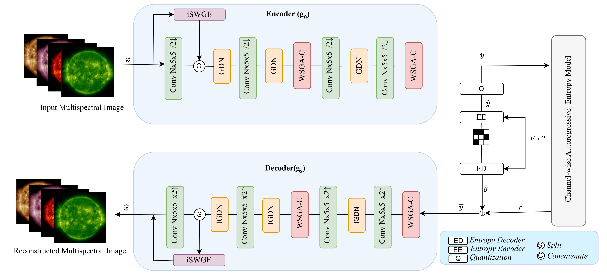
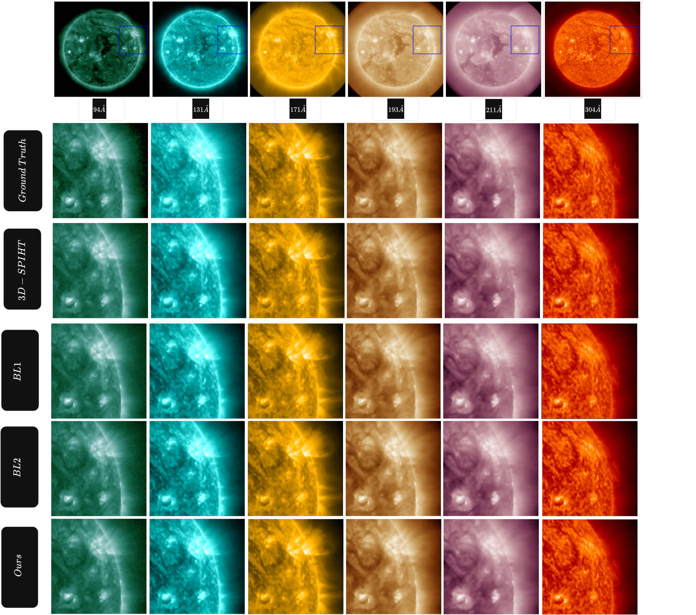
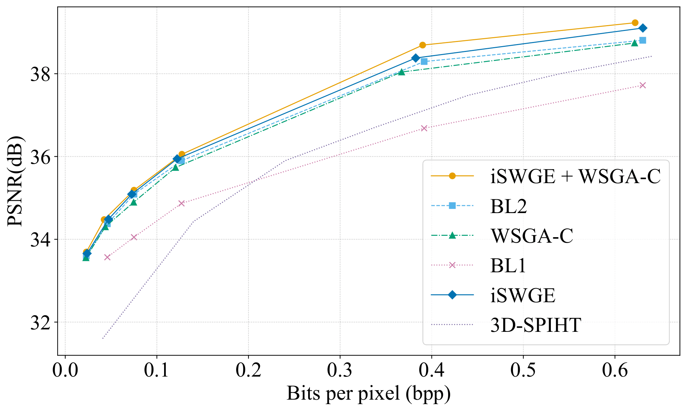
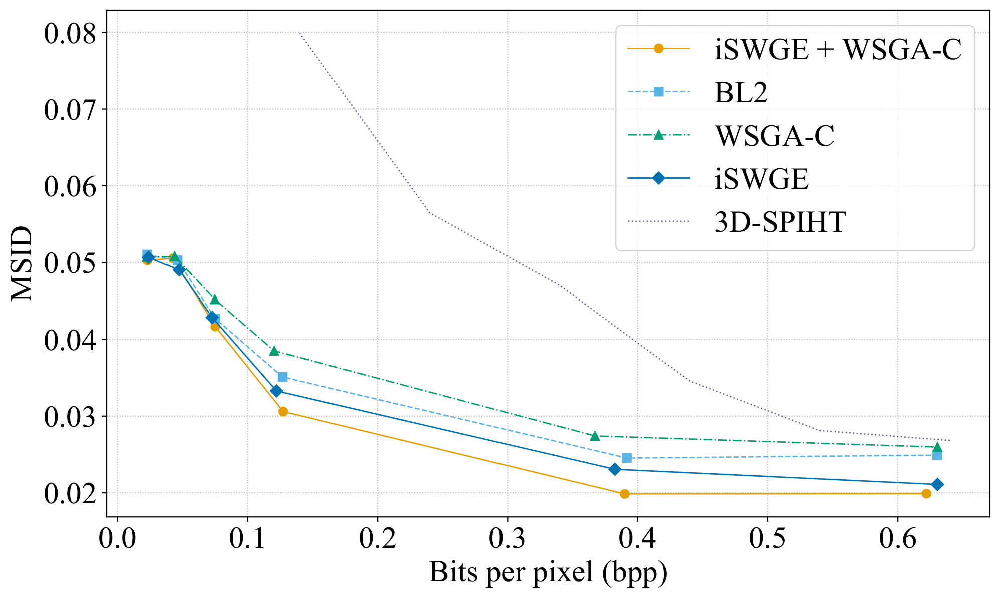

# Spectral and Spatial Graph Learning for Multispectral Solar Image Compression

[](https://arxiv.org/abs/2512.24463)
[](https://ieeexplore.ieee.org/document/11471480)

This repository contains the official PyTorch implementation for the paper **"Spectral and Spatial Graph Learning for Multispectral Solar Image Compression"**. 

## Abstract
High-fidelity compression of multispectral solar imagery remains challenging for space missions, where limited bandwidth must be balanced against preserving fine spectral and spatial details.
We present a learned image compression framework tailored to solar observations, leveraging two complementary modules: 
1. **Inter-Spectral Windowed Graph Embedding (iSWGE):** Explicitly models inter-band relationships by representing spectral channels as graph nodes with learned edge features. 
2. **Windowed Spatial Graph Attention and Convolutional Block Attention (WSGA-C):** Combines sparse graph attention with convolutional attention to reduce spatial redundancy and emphasize fine-scale structures.

Evaluations on the SDOML dataset across six extreme ultraviolet (EUV) channels show that our approach achieves a 20.15% reduction in Mean Spectral Information Divergence (MSID), 
up to 1.09% PSNR improvement, and a 1.62% log-transformed MS-SSIM gain over strong learned baselines, delivering sharper and spectrally faithful reconstructions at comparable bits-per-pixel rates.

## Architecture

<p align="center">
  
</p>

> Overview of the proposed multispectral compression framework. The encoder $g_a$ fuses spectral features from iSWGE with spatial features, followed by WSGA-C blocks.

## Installation

Install [CompressAI](https://github.com/InterDigitalInc/CompressAI) and the packages required for development.
```bash
conda create -n sgraph_env python=3.8
conda activate sgraph_env
pip install compressai
pip install pybind11
git clone https://github.com/agyat4/sgraph.git sgraph
cd sgraph
pip install -e .
pip install -e '.[dev]'
```

> **Note**: This setup requires PyTorch 1.9+ and CUDA for GPU acceleration (recommended for NVIDIA A30 GPU training).

## Usage

### Training

Train a model with rate‑distortion optimization. The example below uses the `wgrcnn_cw` architecture with a Lagrangian multiplier of `0.0048`.

```bash
python train.py -d /path/to/your/dataset \
                -m wgrcnn_cw \
                -e 100 \
                --batch-size 16 \
                --lambda 0.0048 \
                --save \
                --save_path /path/to/save/checkpoint.path.tar \
                --cuda
```


### Evaluation 

```bash
python -m compressai.utils.eval_model \
       -d /path/to/your/test_dataset \
       -a wgrcnn_cw \
       -p /path/to/checkpoint1.path.tar /path/to/checkpoint2.path.tar \
       --cuda
```

## Results

### Qualitative Visualization

<p align="center">
  
</p>

> Visualization of the reconstructed multispectral solar images compared to baselines.
<p align="center">
  
  
  <br>
  <em>
    <strong>Left:</strong> RD curves for PSNR vs BPP and MS‑SSIM vs BPP. 
    The proposed spectral‑spatial model achieves up to 0.4 dB PSNR improvement 
    over multi‑channel joint encoding baselines. 
    <strong>Right:</strong> MSID vs BPP. The full (iSWGE + WSGA‑C) model 
    achieves up to a 20.15% reduction in MSID relative to joint encoding baselines.
  </em>
</p>


## Related links
 * CompressAI: https://github.com/InterDigitalInc/CompressAI
 * Swin-Transformer: https://github.com/microsoft/Swin-Transformer
 * Range Asymmetric Numeral System code from Fabian 'ryg' Giesen: https://github.com/rygorous/ryg_rans
 * Window Based Image compression: https://github.com/Googolxx/STF
 * GABIC: GRAPH-BASED ATTENTION BLOCK FOR IMAGE COMPRESSION:https://github.com/EIDOSLAB/GABIC
 * CensNet: https://github.com/ronghangzhu/CensNet


## Citation

If you find this code or our research helpful, please cite our paper as published in **ICMLA 2025**.  
*(A free preprint is also available at [arXiv:2512.24463](https://arxiv.org/abs/2512.24463).)*

```bibtex
@INPROCEEDINGS{11471480,
  author={Siwakoti, Prasiddha and Khoshkhahtinat, Atefeh and Mehta, Piyush M. and Thompson, Barbara J. and Kirk, Michael S. F. and Da Silva, Daniel},
  booktitle={2025 International Conference on Machine Learning and Applications (ICMLA)}, 
  title={Spectral and Spatial Graph Learning for Multispectral Solar Image Compression}, 
  year={2025},
  volume={},
  number={},
  pages={607-614},
  keywords={Aerospace and electronic systems;Space missions;Telemetry;Aerospace engineering;Space exploration;Filtering;Filters;Integrated circuits;Data communication;Pixel;multispectral learned image compression;graph neural network;feature embedding;solar imagery},
  doi={10.1109/ICMLA66185.2025.00089}
}


